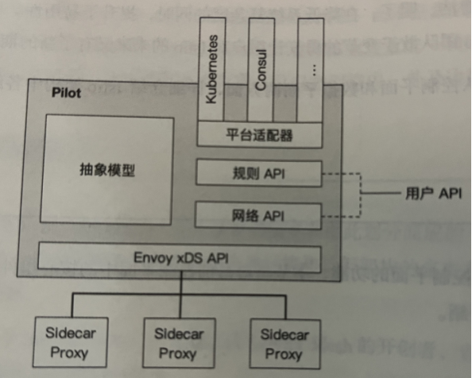
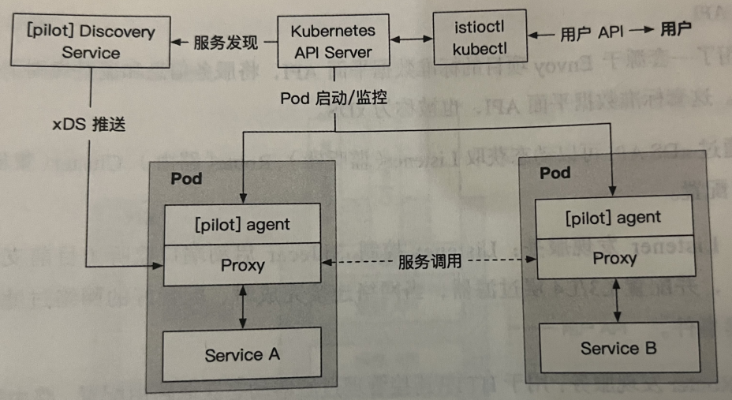

# Istio源码分析

Source Code From

https://github.com/istio/istio/archive/refs/tags/1.14.1.zip

## 架构

## Pilot
### 架构

1.抽象模型(Abstract Model)：为了实现对不同服务注册中心（Kubernetes、Consul等）的支持，Pilot需要对不同来源的输入数据进行统一格式的存储。

2.平台适配器(Platform Adapters）：Pilot的实现是基于平台适配器的，借助平台适配器Pilot可以实现服务注册中心数据和抽象模型数据之间的转换。

3.xDS API：一套源于Envoy项目的标准数据平面API，将服务信息和流量规则下发到数据平面的Sidecar中。

4.用户API (User API)：提供了面向业务的高层抽象，可以被运维人员理解和使用。

### 实现

* Discovery Service：即pilot-diecovery，主要功能是从Service Provider(如Kubernetes或Consul)中获取服务信息，从Kubernetes API Server中获取流量规则(Kubernetes CRD Resource），并将服务信息和流量规则转化为数据平面可以理解的格式，通过标准的数据平面API下发到网格中的各个Sidecar中。
* agent：即pilot-agent组件，该进程根据Kubernetes API Server中的配置信息生成Envoy的配置文件，负责启动、监控Sidecar进程。
* ●Proxy：即Sidecar Proxy, 是所有服务的流量代理，直接连接pilot-discovery，间接地从Kubernetes等服务注册中心获取集群中微服务的注册情况。 
* Service A/B：即使用了Istio的应用，其进出网络流量会被Proxy接管。

## Citadel
用于证书的签发及生命周期的维护。1.5版本之后移除了Citadel，作为一个模块被整合在istiod中。
### 证书签发实体IstioCA
security/pkg/pki/ca/ca.go:266

security/pkg/server/ca/server.go:39
#### IstioCA的初始化
pilot/pkg/bootstrap/istio_ca.go:378

CA 证书的来源有两种选择：自签名证书；使用命令行参数指定的证书、私钥。其中，NewSelfSignedIstioCAOptions 是通过自己签发证书生成IstioCAOptions的，NewPluggedCertIstioCAOptions函数则是通过读取证书文件继而初始化IstioCAOptions的。

两种方式最终通过NewVerifiedKeyCertBundleFromPem初始化IstioCAOptions.KeyCertBundle接口。
#### 证书签发
security/pkg/pki/ca/ca.go:382
### CertController
Cert控制器在 Kubernetes 场景下需要使用 Secret 卷挂载方式为 Sidecar 提供证书密钥。
#### CertController的创建
security/pkg/k8s/chiron/controller.go:92

cache.NewInformer创建Kubernetes Informer用于监听Secret对象，并注册了资源事件处理回调函数。
#### CertController的核心原理

security/pkg/k8s/chiron/controller.go:228,254
### CA Server的创建和核心原理
CA Server在本质上是一个gRPC服务器，对外提供CreateCertificate接口用于处理CSR请求。

security/pkg/server/ca/server.go:148

## Galley
Galley作为Istio配置管理的核心组件，主要用于用户配置信息的校验、缓存及分发到各组件。1.5版本之后移除了Galley ，作为一个模块被整合在istiod中。
### validation server启动流程
validation server主要负责实现在 Istio 网格中配置的校验功能，其实质是Kubernetes的一个ValidatingAdmissionWebhook。所以，只有在Galley的配置源为Kubernetes集群时，此配置校验功能才生效。

pkg/webhooks/validation/server/server.go:108
### 配置校验
Webhook Server在启动运行后，开始接收用户的请求并对配置进行校验，最后返回校验的结果，它主要通过serveValidate函数实现对Pilot与Mixer组件相关配置的校验。

pkg/webhooks/validation/server/server.go:198,130,203

