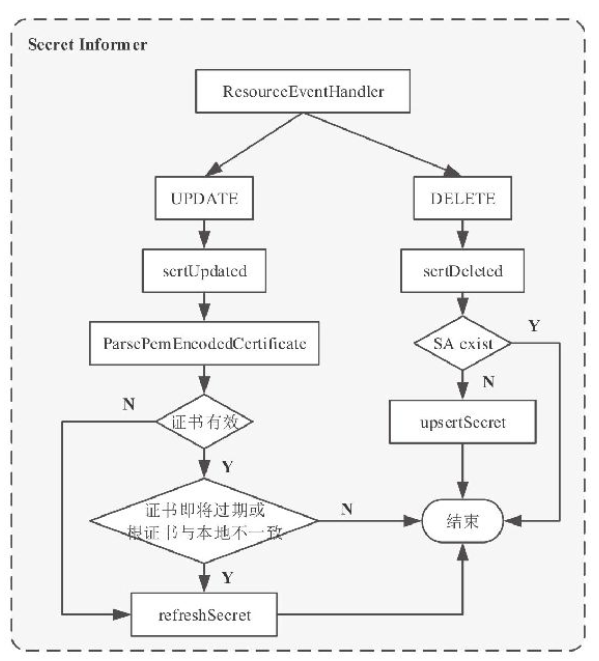

# Istio源码分析

Source Code From

https://github.com/istio/istio/archive/refs/tags/1.14.1.zip

## Security
用于证书的签发及生命周期的维护。1.5版本之后移除了Citadel，作为一个模块被整合在istiod中。
### 证书签发实体IstioCA
security/pkg/pki/ca/ca.go:266

security/pkg/server/ca/server.go:39
#### IstioCA的初始化
pilot/pkg/bootstrap/istio_ca.go:378

CA 证书的来源有两种选择：自签名证书；使用命令行参数指定的证书、私钥。其中，NewSelfSignedIstioCAOptions 是通过自己签发证书生成IstioCAOptions的，NewPluggedCertIstioCAOptions函数则是通过读取证书文件继而初始化IstioCAOptions的。

两种方式最终通过NewVerifiedKeyCertBundleFromPem初始化IstioCAOptions.KeyCertBundle接口。
#### 证书签发
security/pkg/pki/ca/ca.go:382
### CertController
Cert控制器在 Kubernetes 场景下需要使用 Secret 卷挂载方式为 Sidecar 提供证书密钥。
#### CertController的创建
security/pkg/k8s/chiron/controller.go:92

cache.NewInformer创建Kubernetes Informer用于监听Secret对象，并注册了资源事件处理回调函数。
#### CertController的核心原理

security/pkg/k8s/chiron/controller.go:228,254
### CA Server的创建和核心原理
CA Server在本质上是一个gRPC服务器，对外提供CreateCertificate接口用于处理CSR请求。

security/pkg/server/ca/server.go:148

