# Istio源码分析
Source Code From

https://github.com/istio/istio/archive/refs/tags/1.18.0.zip

## 目录
-   [Istio源码分析](#istio源码分析)
    -   [目录](#目录)
    -   [Pilot](#pilot)
        -   [启动流程](#启动流程)
        -   [ConfigController](#configcontroller)
            -   [核心接口](#核心接口)
            -   [初始化](#初始化)
            -   [核心工作机制](#核心工作机制)
        -   [ServiceController](#servicecontroller)
            -   [核心接口](#核心接口-1)
            -   [初始化流程](#初始化流程)
            -   [工作机制](#工作机制)
        -   [xDS的异步分发](#xds的异步分发)
            -   [任务处理函数的注册](#任务处理函数的注册)
            -   [Config控制器的任务处理流程](#config控制器的任务处理流程)
            -   [Service控制器的任务处理流程](#service控制器的任务处理流程)
            -   [资源更新事件处理：xDS分发](#资源更新事件处理xds分发)
        -   [对xDS更新的预处理](#对xds更新的预处理)
            -   [防抖动](#防抖动)
            -   [XDSServer的缓存更新](#xdsserver的缓存更新)
            -   [PushContext（推送上下文）的初始化](#pushcontext推送上下文的初始化)
            -   [Pilot-push事件的发送及井发控制](#pilot-push事件的发送及井发控制)
        -   [xDS配置的生成及分发](#xds配置的生成及分发)
    -   [Citadel](#citadel)
        -   [启动流程](#启动流程-1)
            -   [Istio-CA的创建](#istio-ca的创建)
            -   [SDS服务器的初始化](#sds服务器的初始化)
            -   [Istio-CA的启动](#istio-ca的启动)
        -   [CA服务器的核心原理](#ca服务器的核心原理)
        -   [证书签发实体IstloCA](#证书签发实体istloca)
        -   [CredentialsController](#credentialscontroller)
            -   [创建](#创建)
            -   [核心原理](#核心原理)
    -   [Galley](#galley)
        -   [启动流程](#启动流程-2)
            -   [Galley-WebhookServer的初始化](#galley-webhookserver的初始化)
            -   [ValidatingWebhookConfiguration控制器的初始化](#validatingwebhookconfiguration控制器的初始化)
        -   [配置校验](#配置校验)
        -   [Validating控制器的实现](#validating控制器的实现)
    -   [Pilot-agent](#pilot-agent)
        -   [启动与监控](#启动与监控)
        -   [xDS转发服务](#xds转发服务)
        -   [SDS证书服务](#sds证书服务)
        -   [健康检查](#健康检查)
            -   [应用容器的LivenessProbe探测](#应用容器的livenessprobe探测)
            -   [应用容器的ReadinessProbe探测](#应用容器的readinessprobe探测)
            -   [Envoy进程的ReadinessProbe探测](#envoy进程的readinessprobe探测)
            -   [Pilot-agent进程的LivenessProbe探测](#pilot-agent进程的livenessprobe探测)

## Pilot
Pilot是 Istio控制面的核心组件,它的主要职责有如下两个：

（1）为Sidecar 提供监听器、Route、Cluster、 Endpoint、DNS Name Table等 xDS配置。Pilot在运行时对外提供 gRPC服务，在默认情况下，所有Sidecar代理与Pilot之间都建立了一条gRPC长连接,并且订阅xDS配置。

（2）通过底层平台Kubernetes或者其他注册中心进行服务和配置规则发现,并且实时、动态地进行xDS 生成和分发。

### 启动流程
Pilot组件是由pilot-discovery进程实现的，实际上其他组件如 Citadel、Galley的启动入口都书到了pilot/cmd/pilot-discovery/app/cmd.go中

pilot/cmd/pilot-discovery/app/cmd.go:72

pilot/pkg/bootstrap/server.go:103

### ConfigController
ConfigController（配置资源控制器）主要用于监听注册中心的配置资源，在内存中缓存监听到的所有配置资源，并在 Config 资源更新时调用注册的事件处理函数。由于需要支持多注册中心，因此ConfigController实际上是多个控制器的集合。

#### 核心接口
pilot/pkg/model/config.go:212,153

#### 初始化

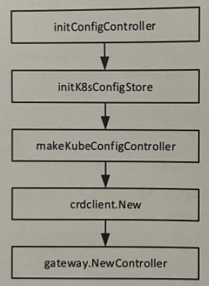

pilot/pkg/bootstrap/configcontroller.go:61,135,346

pilot/pkg/config/kube/crdclient/client.go:61

另外，虽然Istio没有适配器可直接对接其他注册中心，但Istio提供了可扩展的接口协议MCP，方便用户集成其他第三方注册中心。MCP ConfigController与Kubernetes ConfigController基本类似，均实现了ConfigStoreController接口，支持Istio配置资源的发现，并提供了缓存管理功能。在创建MCP ConfigController时需要通过MeshConfig.ConfigSources指定MCP服务器的地址。

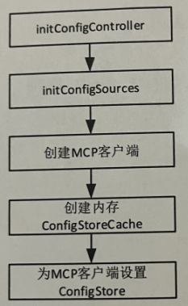

pilot/pkg/bootstrap/configcontroller.go:211

#### 核心工作机制
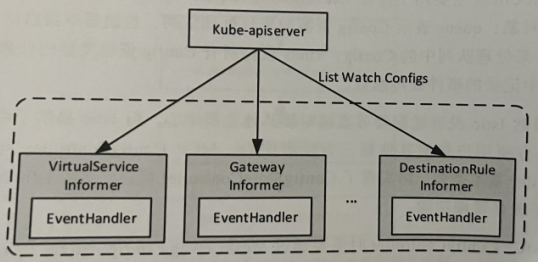
pilot/pkg/config/kube/crdclient/cache_handler.go:86,40,77

pilot/pkg/bootstrap/server.go:918

完整的Config事件处理流程:

（1）EventHandler构造任务(Task)，任务实际上是对onEvent的封装。

（2）EventHandler将任务推送到ConfigController的任务队列(Task queue)。

（3）任务处理协程阻塞式地读取任务队列，执行任务，通过onEvent方法处理事件，并通过configHandler触发xDS的更新。

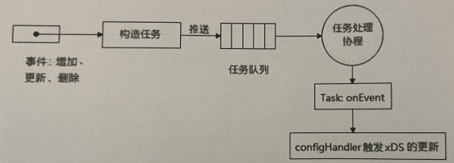

### ServiceController
ServiceController（服务控制器）是服务发现的核心模块，主要功能是监听底层平台的服务注册中心，将平台服务模型转换成Istio服务模型并缓存；同时根据服务的变化，触发相关服务的事件处理回调函数的执行。

#### 核心接口
ServiceController对外为DiscoveryServer中的XDSServer提供了通用的服务模型查询接口ServiceDiscovery。ServiceController可以同时支持多个服务注册中心，因为它包含不同的注册中心控制器，它们的聚合是通过抽象聚合接口（aggregate.Controller）完成的。

pilot/pkg/serviceregistry/aggregate/controller.go:45,129

pilot/pkg/serviceregistry/instance.go:26

pilot/pkg/model/controller.go:40

pilot/pkg/model/service.go:736

#### 初始化流程

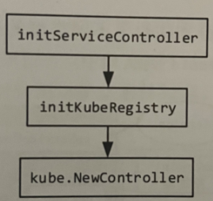

pilot/pkg/serviceregistry/kube/controller/controller.go:224

Kubernetes控制器的核心就是监听Kubernetes相关资源(Service、Endpoint、EndpointSlice、Pod、Node) 的更新事件，执行相应的事件处理回调函数；并且进行从Kubernetes资源对象到Istio资源对象的转换，提供一定的缓存能力，主要是缓存Istio Service与WorkloadInstance。

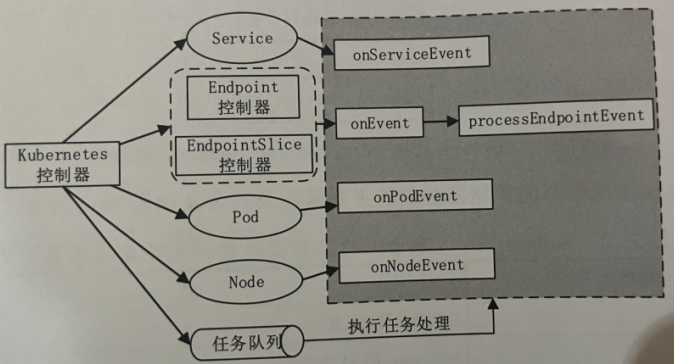

其中，Kubernetes控制器主要负责对4种资源的监听和处理，对于每种类型的资源，控制器分别启动了独立的Informer负责List-Watch, 并且分别注册了不同类型的事件处理函数（onServiceEvent、onPodEvent、onNodeEvent、onEvent）到队列中。

#### 工作机制
ServiceController为4种资源分别创建了Kubernetes Informer，用于监听Kubernetes资源的更新，并为其注册EventHandler。

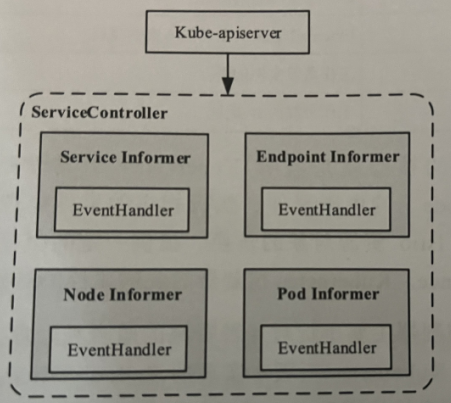

当监听到Service、Endpoint、Pod、Node资源更新时，EventHandler 会创建资源处理任务并将其推送到任务队列，然后由任务处理协程阻塞式地接收任务对象，最终调用任务处理函数完成对资源对象的事件处理。

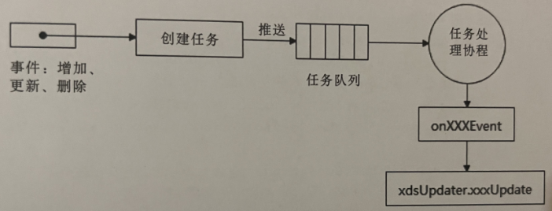

pilot/pkg/bootstrap/server.go:899

pilot/pkg/serviceregistry/kube/controller/endpointcontroller.go:58

pilot/pkg/serviceregistry/kube/controller/controller.go:352

### xDS的异步分发
#### 任务处理函数的注册
Pilot通过XDSServer处理客户端的订阅请求，并完成xDS配置的生成与下发，而XDSServer的初始化由NewServer完成，因此从实现的角度考虑，将Istio任务处理函数的注册也放在了XDSServer对象的初始化流程中。

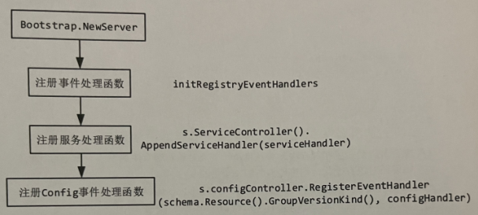

其中，Config事件处理函数通过配置控制器的RegisterEventHandler方法注册，Service事件处理函数通过model.Controllcr.AppendServiceHandler方法注册。

#### Config控制器的任务处理流程
pilot/pkg/config/kube/crdclient/client.go:195

pilot/pkg/bootstrap/server.go:918

pilot/pkg/xds/discovery.go:338

#### Service控制器的任务处理流程
pilot/pkg/serviceregistry/kube/controller/controller.go:1257

pilot/pkg/bootstrap/server.go:899

pilot/pkg/serviceregistry/kube/controller/controller.go:460

pilot/pkg/serviceregistry/kube/controller/endpointcontroller.go:58,84

pilot/pkg/xds/eds.go:65,101

#### 资源更新事件处理：xDS分发
从根本上讲，Config、Service、Endpoint对资源的处理最后都是通过调用ConfigUpdate方法向XDSServer的pushChannel队列发送PushRequest实现的。

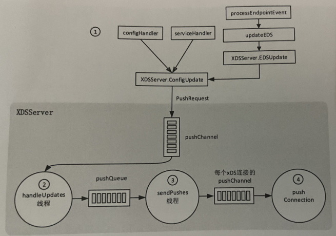

XDSServer首先通过handleUpdates线程阻塞式地接收并处理更新请求，并将PushRequest发送到XDSServer的pushQueue中，然后由sendPushes线程并发地将PushRequest发送给每一条连接的pushChannel，最后由XDSServer的流处理接口处理分发请求。

### 对xDS更新的预处理
#### 防抖动
pilot/pkg/xds/discovery.go:355,363

#### XDSServer的缓存更新
数量最大的缓存是EndpointShardsByService（全量的IstioEndpoint集合），也是在Service、Endpoint更新时，ServiceController主要维护的缓存。EnvoyXdsServer根据EndpointShardsByService可以快速构建本轮需要下发的EDS配置。

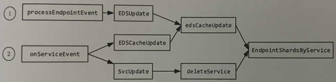

EndpointShardsByService的更新主要在以下两种情况下发生:

①在Endpoint的事件处理函数中;

②在Service的事件处理函数中，主要针对Selector有变化或者Service的缓存同步晚于Endpoint的场景。

#### PushContext（推送上下文）的初始化
pilot/pkg/model/push_context.go:198,1179

#### Pilot-push事件的发送及井发控制
pilot/pkg/xds/discovery.go:482

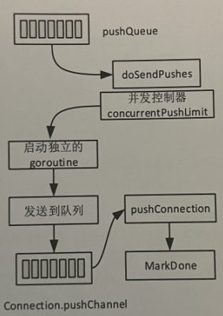

### xDS配置的生成及分发
pilot/pkg/xds/ads.go:741

pilot/pkg/xds/xdsgen.go:97

Pilot主要负责6种xDS配置资源CDS、EDS、LDS、RDS、ECDS、NDS的生成及下发。以CDS生成器为例，XDSServer根据代理的属性及PushContext缓存生成原始的Cluster配置。

pilot/pkg/networking/core/v1alpha3/cluster.go:151

## Citadel
Citadel作为Istio安全的核心组件，主要用于为工作负载签发证书及处理网关的SDS请求，还能为Istiod服务器签发证书。

### 启动流程
pilot/pkg/bootstrap/server.go:230,1176

其中的关键代码包含3部分：Istio CA的创建;SDS服务器的初始化;Istio CA的启动。

#### Istio-CA的创建
pilot/pkg/bootstrap/server.go:1209

#### SDS服务器的初始化
pilot/pkg/bootstrap/server.go:528

#### Istio-CA的启动
pilot/pkg/bootstrap/server.go:1260

pilot/pkg/bootstrap/istio_ca.go:148

### CA服务器的核心原理
CA服务器在本质上是一个gRPC服务器，对外提供CreateCertificate接口，用于处理CSR请求，Istio所有工作负载证书的签发归根结底都会通过CreateCertificate接口进行。CA服务器默认基于TLS证书接收安全的gRPC连接。

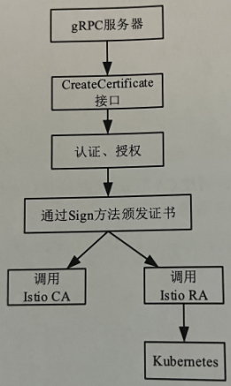

security/pkg/server/ca/server.go:76

### 证书签发实体IstloCA
security/pkg/pki/ca/ca.go:293

security/pkg/server/ca/server.go:41

security/pkg/pki/ca/ca.go:343,421

security/pkg/pki/ra/k8s_ra.go:93,64

security/pkg/k8s/chiron/utils.go:113

### CredentialsController
pilot/pkg/credentials/model.go:21

#### 创建
pilot/pkg/credentials/kube/secrets.go:78

#### 核心原理
pilot/pkg/credentials/kube/secrets.go:285

pilot/pkg/bootstrap/server.go:539

## Galley
Galley作为Istio配置管理的核心组件，是一种典型的Kubernetes准入控制器，主要用于Istio API校验，也可用于维护自身的配置ValidatingWebhookConfiguration。

### 启动流程
pilot/pkg/bootstrap/server.go:342

#### Galley-WebhookServer的初始化
pilot/pkg/bootstrap/webhook.go:46

pkg/webhooks/validation/server/server.go:117

#### ValidatingWebhookConfiguration控制器的初始化
pkg/webhooks/validation/controller/controller.go:98,112

pkg/webhooks/validation/controller/controller.go:180

### 配置校验
pkg/webhooks/validation/server/server.go:200,129,204

### Validating控制器的实现
pkg/webhooks/validation/controller/controller.go:112,190,139

pkg/kube/controllers/queue.go:110,147

## Pilot-agent
Pilot-agent是Istio提供的进程，在注入istio-proxy容器时被启动，负责数据面代理Envoy进程的启动及生命周期维护、Envoy与控制面Istiod进程的通信中转、证书的创建与轮转、健康检查探测等工作。

### 启动与监控
Pilot-agent进程的首要功能是作为istio-proxy容器的启动入口进程，Pilot-agent进程在启动时对命令行参数、环境变量、Pod的metadata等信息进行加工，并创建Envoy进程启动配置文件/etc/istio/proxy/envoy-rev0.json，然后Pilot-agent进程启动Envoy进程并监控进程的运行状态（是否退出），只要Envoy进程退出，则整个Pod重启。

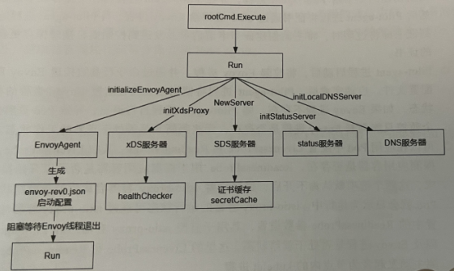

pilot/cmd/pilot-agent/main.go:28

pilot/cmd/pilot-agent/app/cmd.go:61,96

pkg/istio-agent/agent.go:335,510,247

pkg/bootstrap/instance.go:114,62

pkg/envoy/agent.go:101,132

pkg/envoy/proxy.go:99

pkg/envoy/admin.go:39

pkg/envoy/agent.go:217

pkg/envoy/proxy.go:165

### xDS转发服务

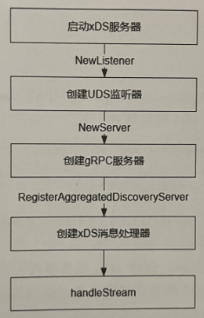

pkg/istio-agent/xds_proxy.go:126,659,302,308,378

pkg/istio-agent/xds_proxy.go:452,729

pkg/istio-agent/xds_proxy.go:526,616

### SDS证书服务
SDS消息由Pilot-agent进程内的sdsServer模块处理，sdsServer负责Envoy进程启动后证书的创建及定期轮转。之所以SDS消息没有与其他xDS一起通过XdsProxy代理处理并被直接转发到Istiod控制面，一个主要原因是证书创建过程中不是简单地对原始SDS消息进行转发，而需要由Pilot-agent进程接收SDS请求后根据请求内容创建证书申请消息CSR。在此过程中，Pilot-agent进程需要创建私钥和公钥，如果直接将私钥发送到网络上，则会增加安全风险。因此，如果将CSR处理放在istio-proxy容器内，则不会有此类问题。另一个原因是，由Pilot-agent进程在证书创建过程中向Istiod控制面发送标准CSR而不是其他私有证书生成协议，可以使证书创建过程更加标准化，使得Pilot-agent进程可以对接除Istiod的多种证书服务器。

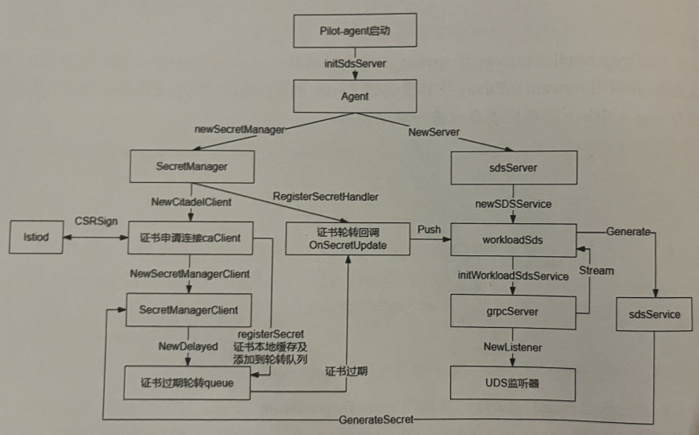

pkg/istio-agent/agent.go:412,786

security/pkg/nodeagent/cache/secretcache.go:166

security/pkg/nodeagent/sds/server.go:49

security/pkg/nodeagent/sds/sdsservice.go:105,62

security/pkg/nodeagent/sds/server.go:89

security/pkg/nodeagent/cache/secretcache.go:206

security/pkg/nodeagent/sds/sdsservice.go:210

pilot/pkg/xds/ads.go:241,133,192

pilot/pkg/xds/xdsgen.go:97

security/pkg/nodeagent/sds/sdsservice.go:184,159

security/pkg/nodeagent/cache/secretcache.go:252,564,654

security/pkg/nodeagent/sds/server.go:59

### 健康检查
Envoy健康检查遵循Kubernetes标准，主要分为ReadinessProbe、LivenessProbe两大类。LivenessProbe用于判断服务是否存在，ReadinessProbe用于进一步判断服务是否准备好。这两个探测选项在应用Pod中是可选配置，如果没有指定，则Istio认为应用容器启动后就可以提供服务。但需要注意的是，在Istio中，由于自动注人了istio-proxy容器，因此也需要判断其中的Pilot-agent进程及Envoy进程是否处于可用状态，在注入过程中会自动添加对Pilot-agent进程及Envoy进程进行判断的ReadinessProbe，这样Kubelet在运行中也会自动发送对每个带有注入容器的应用Pod的探测。

#### 应用容器的LivenessProbe探测

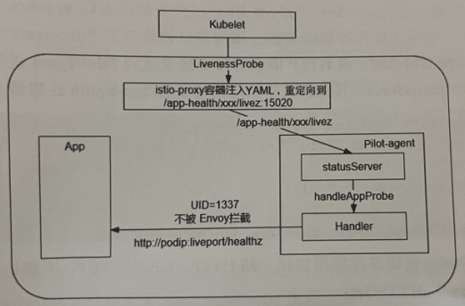

如果需要启动应用的LivenessProbe探测，需要在应用容器的Deployment文件中配置：

```
spec:
  containers:
  - name: frontend
    #  开启LivenessProbe探测
    livenessProbe:
	  # 设置探测方式
      httpGet:
        path: /healthz
        port: 8080
		......
```

上面的配置告知Kubelet定期向应用Pod发送HTTP探测请求，该请求在没有使用Istio网格的情况下将直接被应用容器接收，但在注入了istio-proxy容器后，处理路径发生了变化。可以通过kubectl get pod命令获取已经启动的Pod描述文件，发现LivenessProbe已经被修改为如下形式:

```
spec:
  containers:
  ......
  #开启LivenessProbe探测
  livenessProbe:
    failureThreshold: 3
	httpGet:
	  # 探测目标被修改为新URL
	  path: /app-health/frontend/livez
	  # 探测目标端口为Pilot-agent监听端口
	  port: 15020
	  scheme: HTTP
```

LivenessProbe的探测URL已经被修改为以/app-health开头、livez结尾的URL形式，中间为应用容器的名称。探测端口被修改为Pilot-agent监听端口15020。当Kubelet发送探测请求时，该HTTP请求将被直接发送到Pilot-agent进程。在Pilot-agent进程运行时启动statusServer，其线程任务管理器将安装/app-health处理器handleAppProbe

pilot/cmd/pilot-agent/status/server.go:354,671,697

#### 应用容器的ReadinessProbe探测

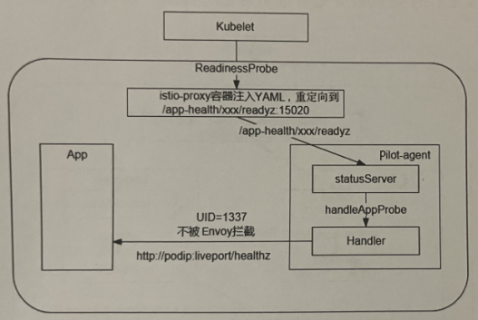

与应用的LivenessProbe处理流程非常相似，也需要在应用容器Deployment文件中配置ReadinessProbe选项:

```
spec:
  containers:
  - name: frontend
    # 开启ReadinessProbe探测
    readinessProbe:
	  # 失败3次后重启
	  failureThreshold: 3
	  httpGet:
	    # 探测URL地址
		path: /app-health/frontend/readyz
		port: 15020
		scheme: HTTP
	  periodSeconds: 10
	  successThreshold: 1
	  timeoutSeconds: 1
```

与LivenessProbe不同的是ReadinessProbe的URL后缀变为readyz，这样就会在Pilot-agent进程对HTTP请求进行处理的handleAppProbeHTTPGet中匹配到不同的KubeAppProbers，并组成向应用容器发送的ReadinessProbe探测请求。

#### Envoy进程的ReadinessProbe探测

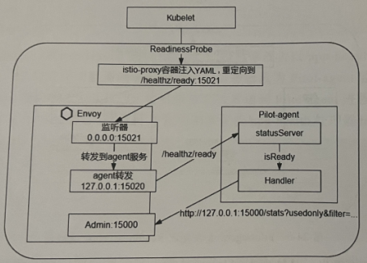

针对Sidecar内系统服务的ReadinessProbe探测，是通过在自动注入过程中对istio-proxy容器的Deployment文件增加ReadinessProbe配置实现的。

```
spec:
  containers:
  - name: istio-proxy
    # 开启Envoy进程的ReadinessProbe探测
    readinessProbe:
	  failureThreshold: 30
	  httpGet:
	    # 固定探测路径
		path: /healthz/ready
		# 固定探测端口指向Envoy进程
		port: 15021
		scheme: HTTP
	  initialDelaySeconds: 1
	  periodSeconds: 2
	  successThreshold: 1
	  timeoutSeconds: 3
```

使用kubelet命令向Envoy 15000的Admin端口发送/config_dump命令来得到监听器配置：

```
"address": {
  "socket_address": {
    "address": "0.0.0.0",
	# 匹配Envoy监听器
	"port_value": 15021
  }
}
"filter_chains": [
{
  "filters": [
  {
    "name": "envoy.filters.network.http_connection_manager",
	"typed_config": {
	  "@type": "type.googleapis.com/envoy.extonsions.fllters.network.http_connection_manager.v3.HttpConnectionManager",
	  "stat preflx": "agent",
	  "route_config": {
	    "virtual_hosts": [
		......
		  "routes": [
		  {
		    "match": {
			  # 匹配URL
			  "prefix": "/healthz/ready"
		    },
			"route": {
			  # 路由到目标pilot-agent服务
			  "cluster": "agent"
			}
```

对15021端口的ReadinessProbe请求经过/healthz/ready的URL匹配后，路由到目标agent服务，其目标服务Cluster配置如下：

```
{
  "name": "agent",
  "type": "STATIC",
  "connect_timeout": "0.250s",
  "load_assignment": {
    "cluster_name": "agent",
	"endpoints": [
	{
	  "lb_endpoints": [
	  {
	    "endpoint": {
		  "address": {
		    "socket_address": {
			  "address": "127.0.0.1",
			  "port_value": 15020
```

agent最终连接到Pilot-agent进程的15020端口，其恰好是Pilot-agent进程的statusServer服务端口，并根据原始URL请求地址匹配handleReadyProbe方法。

pilot/cmd/pilot-agent/status/server.go:347,466

pilot/cmd/pilot-agent/status/ready/probe.go:47,88,104,127

pilot/cmd/pilot-agent/status/util/stats.go:71

#### Pilot-agent进程的LivenessProbe探测

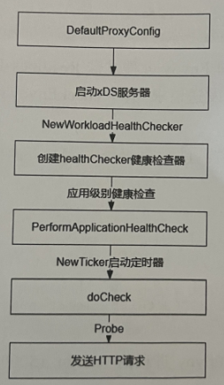

除了由Kubelet触发ReadinessProbe探测，Pilot-agent进程也可以作为探测发起者向应用发送ReadinessProbe探测。此功能默认不开启，不过可以在应用的Deployment文件的注解部分设置开启，开启方式如下：

```
spec:
  selector:
    matchLabels:
	  app: frontend
	  ......
	  annotations:
	    proxy.istio.io/config: |
		  readinessProbe:
		    httpGet:
			  path: /healthz
			  port: 8080
```

pilot/cmd/pilot-agent/config/config.go:38

pkg/istio-agent/xds_proxy.go:149,204,214

pkg/istio-agent/health/health_check.go:85,133